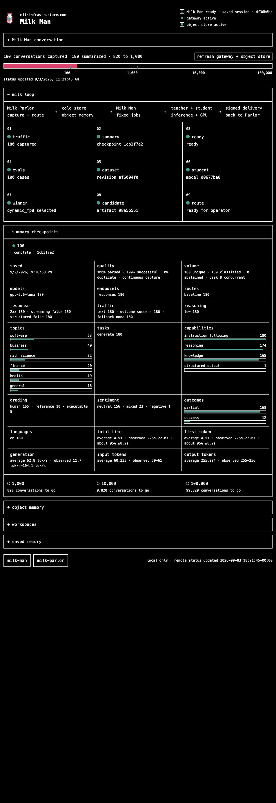

# Milk Man

[Read the Milk documentation](https://milkinfrastructure.com/docs/) first.

Milk has two programs:

- [Milk Parlor](https://github.com/milkinfrastructure/milk-parlor) is the small
  Rust gateway between an application and its model provider. It authenticates,
  routes, streams, and saves eligible completed request and response pairs.
- Milk Man is the local command-line tool that reads those saved conversations,
  summarizes them, creates model tests and training data, trains and compares
  small models, and prepares a traffic rule for a person to approve.

Milk Man is local-first. It needs no Docker, local GPU, database, queue, or
resident daemon. It may edit and commit supervised development work locally;
it does not push, deploy, sign routes, or receive production signing keys.

## Quickstart

Requirements: Bash, Python 3, Git, and `curl`. Install the `zstd` executable
before processing capture objects. Modal operations also require the Modal CLI;
Baseten candidate serving requires `uvx`. Docker is not required.

```bash
git clone https://github.com/milkinfrastructure/milk-man.git
cd milk-man
bin/man dashboard
```

Open <http://127.0.0.1:8765>. The dashboard binds only to `127.0.0.1` and is a
foreground process. `MILK_DASHBOARD_PORT` changes the port;
`MILK_DASHBOARD_REFRESH_SECONDS` changes the cloud-status interval from its
30-second default; and `MILK_PARLOR_BASE_URL` enables the gateway health check.
Restart the dashboard after changing its environment.

The dashboard shows past tasks and messages, workspace changes, configured
environment names, gateway health, and object-store progress. It never displays
environment values. Its prompt box starts only the supervised development
harness; it cannot launch a production job or activate a route. Start one
development task as shown below before using the prompt box.



## Run a supervised development task

The shortest setup uses an OpenAI API key:

```bash
export OPENAI_API_KEY=...

bin/man develop \
  --workspace milk-man="$PWD" \
  --workspace milk-parlor=/absolute/path/milk-parlor \
  -- "inspect both repositories and make one bounded correction"
```

This defaults to `gpt-5.6-sol`, the Responses API, and maximum reasoning.
`LLM_API_URL` plus `LLM_MODEL`, with optional `LLM_API_KEY`, selects another
OpenAI-compatible endpoint. `--resume` continues the latest trajectory for the
exact workspace set; `--traj UUID` selects one explicitly. Run `bin/man --help`
for the complete provider order and bootstrap command.

State defaults to `${XDG_STATE_HOME:-$HOME/.local/state}/milk-man`; set
`MILK_MAN_STATE_DIR` to an absolute dedicated directory to move it.

## Run fixed jobs

Every `bin/milk` invocation emits one `milk.job-result.v2` JSON object to stdout.
Diagnostics go to stderr. Start with an empty local object store:

```bash
export MILK_SCOPE_ID=11111111-1111-4111-8111-111111111111
export MILK_STORE_KIND=local
export MILK_STORE_ROOT="$PWD/.milk-objects"

bin/milk status
bin/milk operate --once
```

`status` reads the current run. `operate --once` advances
`summary`, `eval`, `dataset`, `train`, and `evaluate` while work is immediately
ready, then exits. It stops after evaluation at `select-route-provider`; it does
not choose, sign, or activate a route. An idle run makes zero inference and
provider calls.

The complete fixed command surface is:

```text
bin/milk status
bin/milk operate --once
bin/milk run inference-ensure
bin/milk run inference-status
bin/milk run inference-stop
bin/milk run summary
bin/milk run eval
bin/milk run dataset
bin/milk run train
bin/milk run evaluate
bin/milk run route-propose-baseten
bin/milk run route-propose-modal
bin/milk run gpu-reconcile-modal
```

Provider proposal jobs are explicit and separate. A credential being present
never starts a provider job, and failure in one provider does not select another.
Milk Man writes unsigned proposals only; the operator-controlled Milk Parlor
release path signs and publishes routes.

## Storage and job environment

Every store uses:

```text
MILK_SCOPE_ID
MILK_STORE_KIND=local|s3
```

`MILK_SCOPE_PROFILE=production|mechanics` and `MILK_STORE_TIMEOUT_SECONDS` are
optional. Local storage additionally requires an absolute `MILK_STORE_ROOT`.
S3-compatible object storage, such as Cloudflare R2 or Amazon S3, requires:

```text
MILK_STORE_ENDPOINT
MILK_STORE_REGION
MILK_STORE_BUCKET
MILK_STORE_ACCESS_KEY_ID
MILK_STORE_SECRET_ACCESS_KEY
```

`MILK_STORE_SESSION_TOKEN` and `MILK_STORE_PATH_STYLE` are optional. Cloudflare
R2 uses the S3 implementation with its account endpoint.

Inference, training, evaluation, and serving jobs use only their named settings
from [`config/jobs.json`](config/jobs.json). Some values are conditionally
required: `MILK_EVAL_IMAGE` is required when evaluation reaches Baseten, and
each Modal operation needs its Modal credentials and CLI. Settings and secrets
remain environment variables; never place their values in repository files.

Durable objects live under `milk/v2/scopes/<scope_uuid>/`. Versioned objects are
immutable; small conditional `current.json` pointers select active revisions.
The complete object tree and runtime contract are in
[`goal_tracker.md`](goal_tracker.md).

## Capture traffic with Milk Parlor

Applications use the official OpenAI package, not a Milk SDK. With an
operator-issued Milk key, point the client at Parlor:

```bash
pip install openai # or: npm install openai
export OPENAI_BASE_URL=https://parlor.milkinfrastructure.com/v1
export OPENAI_API_KEY='your Milk key'
```

```python
from openai import OpenAI

milk = OpenAI()
answer = milk.responses.create(model="your-model", input="Hello")
print(answer.output_text)
```

Parlor supports Responses and Chat Completions create routes, including
streaming. It stores complete request and returned-response pairs in the object
store after the response path; Milk Man processes them later. This repository
does not issue gateway keys or deploy Parlor. Follow the
[Milk Parlor repository](https://github.com/milkinfrastructure/milk-parlor) for
gateway operation.

## What we tested

A small end-to-end run sent 180 conversations through Milk Parlor into
Cloudflare R2, summarized all 180, produced 100 model-test cases, and trained
`Qwen/Qwen3.5-0.8B` for one step on a Baseten H100. It compared one 16-bit and
two 8-bit versions, briefly served the selected version on Modal, sent signed
test traffic to it, returned safely to the default model when it stopped,
disabled the test route, and confirmed that no GPU remained running.

This proves that the components connect and stop cleanly. The intentionally tiny
dataset does not establish model usefulness or a production-qualified corpus.
The evidence record is maintained in
[`goal_tracker.md`](goal_tracker.md).

## Reference

- [Job and environment contract](config/jobs.json)
- [Evaluation policy](config/evaluation.json)
- [Pinned student model](config/student.json)
- [Architecture and evidence tracker](goal_tracker.md)
- [Contributing](CONTRIBUTING.md)
- [Security policy](SECURITY.md)
- [Third-party model notices](THIRD_PARTY_MODEL_NOTICES.md)
- [Headlong attribution](vendor/headlong/UPSTREAM.md)
- [Apache-2.0 license](LICENSE) and [notice](NOTICE)
