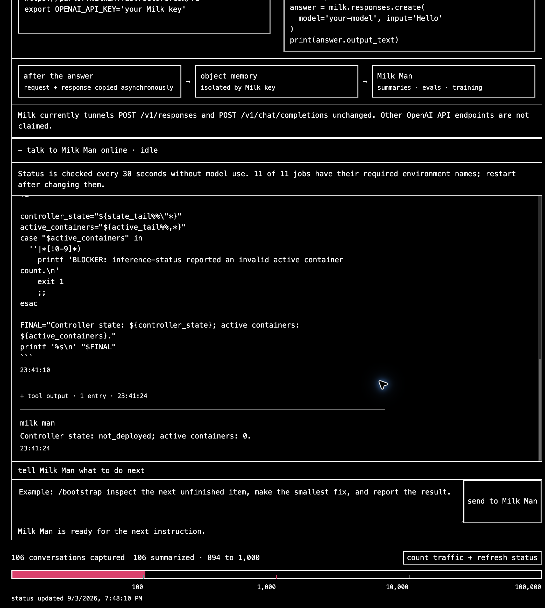
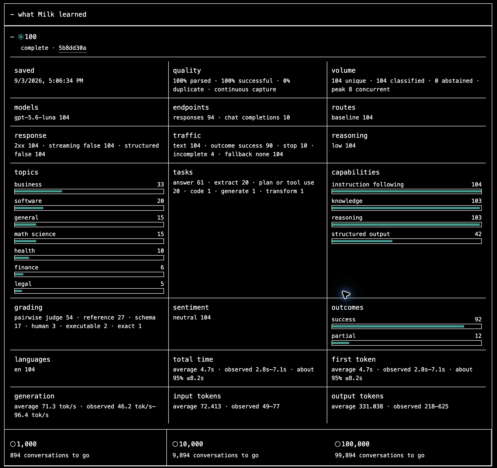
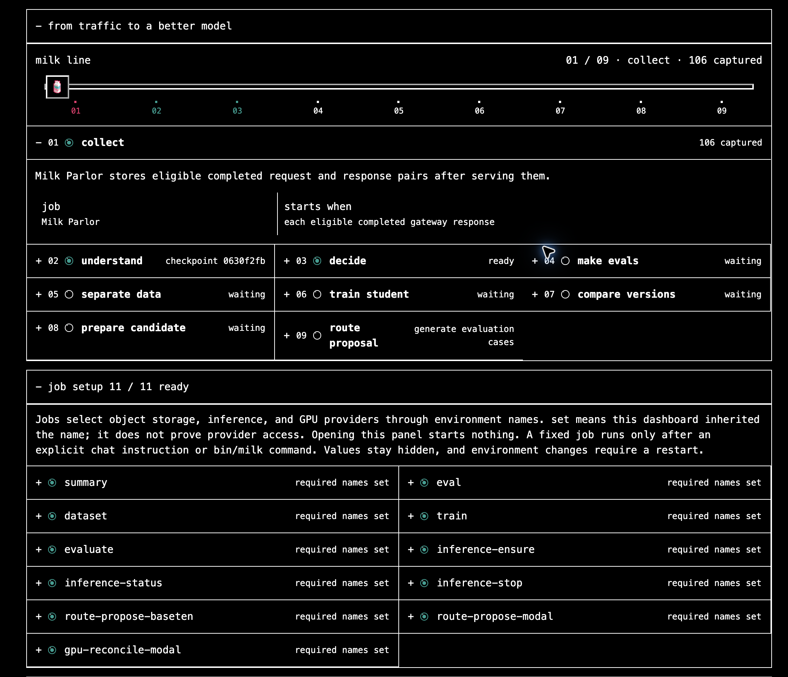
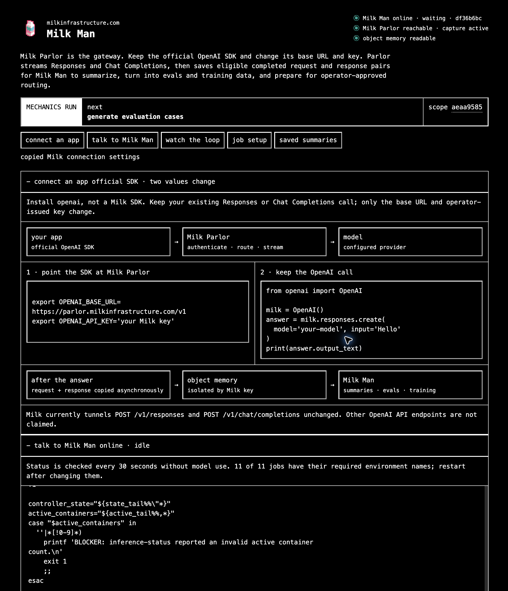

# Milk Man

[Read the Milk documentation](https://milkinfrastructure.com/docs/) first.

Milk has two programs:

- [Milk Parlor](https://github.com/milkinfrastructure/milk-parlor) is the small
  Rust gateway between an application and its model provider. It authenticates,
  routes, streams, and saves eligible request and returned-response bodies after
  each exchange ends.
- Milk Man is a local Bash agent. Give it a task. It runs scripts, operates
  cloud models, measures results and saves its progress. It can use the
  traffic collected by Parlor for summaries, model tests and training.

Milk Man is local-first. It needs no Docker, local GPU, database, queue, or
separate scheduler service. One lightweight local heartbeat owns an active
task, waits without model calls, and resumes it when work changes or becomes
due. The task and configured environment define what Milk Man may operate.

## Quickstart

Requirements: Bash, Python 3, Git, and `curl`. Install the `zstd` executable
before processing capture objects. Modal operations also require the Modal CLI;
Baseten candidate serving requires `uvx`. Docker is not required.

```bash
git clone https://github.com/milkinfrastructure/milk-man.git
cd milk-man
export OPENAI_API_KEY=...
bin/man run --workspace milk-man="$PWD" -- \
  "Inspect this repository and report the next unfinished goal."
```

`run` creates one saved trajectory and keeps its heartbeat in the foreground.
In another terminal, start the optional local view:

```bash
bin/man dashboard
```

Load your environment file before starting Milk Man. Keep `PATH` inherited;
replacing it inside a task can hide the agent's `mem`, `man`, and `milk` commands.

Open <http://127.0.0.1:8765>. `MILK_DASHBOARD_PORT` changes the port,
`MILK_DASHBOARD_REFRESH_SECONDS` changes the 30-second remote-status interval,
and `MILK_PARLOR_BASE_URL` enables the gateway health check. Restart the
dashboard after changing its environment.

The dashboard reads the saved trajectory and heartbeat, sends instructions,
and shows messages, workspace changes, configured environment names, gateway
health, and object-store progress. It never displays environment values.
The heartbeat strip shows the last check, next wake, and idle-check count.
Open **Full task + activity counts** for the complete instruction. The model
setting appears beside chat. The current task is separate from saved data.
Click a checkpoint for its summary; focus or tap `?` to explain a field.
Research shows each experiment's conclusion before its detailed measurements.
Closing the page is not a stop command; current heartbeat proof status is in
[`goal_tracker.md`](goal_tracker.md). On a fresh install, start the first task
from Bash as shown above so the dashboard has a trajectory to resume.

## Dashboard

Chat shows the reply, expandable command output, and the heartbeat beside it.
The input stays separate from the logs. These are real development screenshots
from September 4, 2026, not live status.



Choose **data + summaries** to see saved exchanges and open a summary. Counts
cover the whole summary; topic and task charts describe only the labeled sample.



<details>
<summary>Traffic milestones and SDK setup</summary>

The heartbeat counts stored exchanges. At an environment-defined milestone it
starts the summary job; the dashboard reads the result after the file is saved.



Keep the official OpenAI SDK and change only its base URL and key.



</details>

## Continue or control a task

Restart the same heartbeat with the exact same workspace set:

```bash
bin/man run --resume --workspace milk-man="$PWD"
```

Inspect or control the current heartbeat:

```bash
bin/man heartbeat status
bin/man heartbeat pause
bin/man heartbeat resume
bin/man heartbeat stop
```

`MILK_HEARTBEAT_SECONDS` sets the job-check and first idle interval (30 seconds by default).
`MILK_HEARTBEAT_MAX_SECONDS` caps exponential idle backoff (300 seconds by
default). Idle checks do not call the model. A task may register a scheduled
wake or a read-only status command; changed status resumes the saved task.
Unchanged status watches back off too. Set a shorter maximum when waiting on
billable resources that should be stopped promptly.

To generate summaries as traffic arrives, start the heartbeat with:

```bash
export MILK_AUTO_SUMMARY=1
export MILK_SUMMARY_THRESHOLDS=100,1000,10000,100000
bin/man run --workspace milk-man="$PWD"
```

No prompt is needed to start idle. Use `--resume` to return to an existing task
instead. Counting uses no driver-model calls; the summary job uses its configured
model only when a milestone is reached. Storage and summary settings must already
be present in the environment.

It counts saved request/response objects without calling a model. At a milestone,
it runs the existing summary job with your storage and inference settings.
The dashboard shows the summary after its file is saved. Checking does not
interrupt another job's wait, and a saved milestone is not generated again.
Failed jobs keep their error instead of starting repeated paid attempts.

For one direct turn without the persistent heartbeat:

```bash
bin/man develop \
  --workspace milk-man="$PWD" \
  --workspace milk-parlor=/absolute/path/milk-parlor \
  -- "inspect both repositories and report their current state"
```

This defaults to `gpt-6-astra`, the Responses API, and low reasoning.
The driver uses `bash` to work and `finish` to report completion. For an endpoint without
function calling, explicitly set `MILK_MAN_TOOL_CALLS=0` to use fenced Bash.
`LLM_API_URL` plus `LLM_MODEL`, with optional `LLM_API_KEY`, selects another
OpenAI-compatible endpoint. `--resume` continues the latest trajectory for the
exact workspace set; `--traj UUID` selects one explicitly. Run `bin/man --help`
for the complete provider order and bootstrap command.

Milk Man can send its own model calls through Parlor too. Use a separate Milk
key so agent work stays apart from application traffic:

```bash
export LLM_API_URL=https://parlor.milkinfrastructure.com/v1/responses
export LLM_API_MODE=responses
export LLM_MODEL=gpt-6-astra
export LLM_API_KEY='operator-issued Milk key'
export LLM_MILK_TRAJECTORY_HEADER=1
```

The gateway must have that key and upstream provider configured. The scope UUID
identifies stored conversations; it does not authenticate requests. Agent
exchanges use the same object store. Tool calls and results are retained.
Saved non-streaming exchanges can become training examples without losing
their tool history; training an improved agent on them is not yet proven.
The opt-in header groups calls by the task UUID supplied by `bin/man`; Parlor
stores it and removes it before forwarding. Leave it off for direct providers.

State defaults to `${XDG_STATE_HOME:-$HOME/.local/state}/milk-man`; set
`MILK_MAN_STATE_DIR` to an absolute dedicated directory to move it.

## Research for one scope

Each scope can keep an objective, quality and speed targets, a named baseline,
held-out tasks, experiment results, and the next action in its object store.
The dashboard's **research** panel reads the same record. A saved claim is not
a measured win; compare models on the same tasks before naming a best result.

Use the existing store environment and a small local JSON file:

```bash
bin/milk jobs
MILK_RESEARCH_FILE=/private/path/research.json bin/milk run research
bin/milk run research status
```

The file contains `parent_revision`, `objective`, `targets`, `baseline`,
`evaluation`, `best`, `experiments`, `next_action`, and `wake`. Use `null` for
the first parent and unknown baseline, evaluation, best, or wake. Updates use
the current revision as their parent. Repeating the same write is a no-op.
Keep references and compact results here, not raw traffic or credentials.

Status reads the record and current stage pointers, then checks whether this
scope has enough captures for its next `MILK_SUMMARY_THRESHOLDS` checkpoint.
It lists only that scope's capture keys, stopping at the threshold; it does not
read conversation bodies or call a model. Below the threshold its output stays
unchanged. `MILK_AUTO_SUMMARY=1` runs the summary job directly at a crossed
threshold; no agent reasoning is needed to decide whether to start it. A task
can separately watch research results with `bin/man heartbeat wait -- bin/milk
run research status`.
The record does not start jobs by itself. `wake` describes the plan; the
heartbeat registers the actual watch.

Summaries can classify non-streaming Responses and Chat Completions tool calls
and results. A tool call alone is not a successful task. Streamed tool-event
reconstruction and a measured improvement from this training remain unfinished.

## Run jobs

Every `bin/milk` invocation emits one `milk.job-result.v2` JSON object to stdout.
Its call counts describe that job, not the model calls driving Milk Man.
Diagnostics go to stderr. Read one job's settings, or omit its name to list all jobs:

```bash
bin/milk jobs serve-modal
```

Run these commands directly from Bash while developing; Milk Man calls the
same scripts. `bin/milk jobs` returns every registered job, its exact commands,
and the required and optional environment names for starting a run. Status and stop
commands use saved resource settings. The catalog can include built-in jobs
and repository-owned executable jobs from [`config/jobs.json`](config/jobs.json).
The `serve-modal` executable job has deployed Qwen, served three correct
responses, and stopped its GPU. See [`goal_tracker.md`](goal_tracker.md).
Model weights remain read-only in the selected volume. vLLM's compiled files
use a separate writable volume named `<model-volume>-vllm` between starts.
An executable job receives `run`, `status`, or `stop`, inherits the current
environment plus `MILK_JOB_*` metadata, and returns one JSON result on stdout.
For a long job, use `bin/background /private/new-run -- bin/milk run NAME`,
then watch `bin/background /private/new-run status` with the heartbeat. The
command keeps running if Milk Man restarts. Reusing that directory never starts
another command; logs and the exit receipt stay private in that directory.
When `serve-modal` completes, `details.driver` gives the API URL, model, mode,
and credential environment name for a child agent. Use that serving key, not
the parent's Milk gateway key. `bin/man develop --check` shows the effective
driver settings and step limit without calling the model.
The serving result also records deployment, weight-loading, and readiness times
in `details.observation.startup`. Status keeps those original measurements.
They include provider checks and may use warm caches; they are not GPU-only
startup time or billed duration. Older runs without timings remain unknown.

`serve-baseten` provides the same run/status/stop workflow for an owned Baseten
server. Set its model, exact model revision, runtime image and GPU through the
catalog's `MILK_BASETEN_SERVE_*` settings. Weights mount from Baseten's cache,
not from the image. A small Qwen deployment has completed inference and shutdown;
managed Baseten inference remains a separate option.

To serve a model trained by Milk, also set `MILK_BASETEN_SERVE_CHECKPOINT_KEY`
and `MILK_BASETEN_SERVE_CHECKPOINT_SHA256` to its saved model manifest. The usual
`MILK_STORE_*` settings select storage. Keep `MODEL` and `REVISION` equal to the
manifest's training base. Baseten loads the completed job's `rank-0/merged/`
checkpoint, including its tokenizer, directly into the server; no local weight
download or new image is needed. Omit both checkpoint settings to serve the
original base model. Status and stop reuse the saved deployment settings.

For startup diagnostics, run
`MILK_BASETEN_SERVE_LOG_SECONDS=300 bin/milk run serve-baseten status`.
It reads the existing deployment's latest 20 log entries, removes known secrets,
and limits long lines. Treat the output as private. Ordinary status checks do
not fetch logs; this command never starts or restarts compute.

To compare an agent on a real task, set `MILK_TRIAL_TASK_FILE` and
`MILK_TRIAL_WORKSPACE`, configure the usual `LLM_*` values, and run
`bin/milk run agent-trial`. It records the task, code, timing, tool use and
answer in private state. Repeating the same trial returns its saved receipt
without another model call. `MILK_TRIAL_ID` retrieves an exact earlier trial;
use a new `MILK_TRIAL_ATTEMPT` only to deliberately run again. Judge the answer
against the task: an agent finishing does not mean it answered correctly.

Trials retain input, output, cached and reasoning token counts reported for
recorded driver replies. A total is unknown if any reply omits that count;
`usage_coverage` shows how many replies reported it. Cached and reasoning tokens
are already included in input and output counts, respectively. These are not
billing totals: failed or unrecorded calls and jobs started by the agent are
not included. Older receipts stay unchanged and report usage as unknown.

For a measurable task, set `MILK_TRIAL_CHECK_SCRIPT` to a repository-relative
executable. It reads the child result as JSON on stdin and returns
`{"task_correct":true,"metrics":{"score":1},"reason":"Task result matched"}`.
Only `task_correct` is required. The script is pinned before the trial; a
changed, failed, or invalid checker leaves correctness unknown. It must check
the actual outcome, not trust the agent's success claim. The default checker
timeout is 10 seconds (`MILK_TRIAL_CHECK_TIMEOUT_SECONDS`). Without a checker,
the trial behaves as before. This is optional scoring, not a gate on Milk Man.

To inspect a saved summary, set `MILK_CHECKPOINT_KEY` and
`MILK_CHECKPOINT_SHA256`, then run `bin/milk run checkpoint`. It verifies the
summary and its source history and returns counts, not conversation bodies.
It does not generate data, train, or decide whether an agent succeeded.
Set `MILK_READINESS_KEY` and `MILK_READINESS_SHA256` together to include the
matching saved readiness decision and failed checks. Both files are verified;
the job does not read current pointers or make a new admission decision.

To inspect one captured agent exchange, set `MILK_NATIVE_CAPTURE_KEY` and
`MILK_NATIVE_CAPTURE_SHA256`, then run `bin/milk run native-capture`. It saves
the visible messages, tool definitions, previous tool results, and next
assistant answer in a private local file. The terminal receives only counts
and references. Hidden reasoning is explicitly omitted. Non-streaming text
and function calls are supported; unsupported content is reported rather than
flattened. This preserves an example, not proof that the task succeeded or
that the example should be used for training.

To build a small dataset from a saved summary, keep `MILK_CHECKPOINT_KEY` and
`MILK_CHECKPOINT_SHA256` set and run `bin/milk run native-dataset`. It saves one
supported exchange per task by default; `MILK_NATIVE_DATASET_PER_GROUP` changes
that count. Tools and past results stay intact, and tasks keep their original
data splits. Repeating it reuses the same files without reading conversations
or calling a model. The result reports the manifest key, hash and split counts.

For saved calls outside a summary, unset those checkpoint variables and set
`MILK_NATIVE_CAPTURES_KEY` and `MILK_NATIVE_CAPTURES_SHA256` instead. The pinned
object lists exact captures in the same scope; it cannot assign data splits:

```json
{"schema_version":"milk.native-capture-list.v1","scope_id":"<scope UUID>","profile":"mechanics","captures":[{"key":"<capture object key>","sha256":"<capture SHA-256>"}]}
```

This reads the listed calls without generating a summary or advancing a pointer.
Related calls remain one task, even when several steps are selected.

To select successful training tasks, also set
`MILK_NATIVE_TASK_OUTCOMES_KEY` and `MILK_NATIVE_TASK_OUTCOMES_SHA256` to a saved
outcome index in the same scope:

```json
{"schema_version":"milk.task-outcomes.v1","scope_id":"<scope UUID>","outcomes":[{"trajectory_id":"<executed trajectory UUID>","result":{"key":"<saved trial result key>","sha256":"<result SHA-256>"}}]}
```

Each result is the saved `result.json` from `agent-trial` or `agent-score`, not
the printed job wrapper. Its scored verdict must match
its completed checker; an unscored receipt stays unknown. Only successful TRAIN
tasks are selected. Held-out tasks keep their original membership and content.
The index and result hashes are pinned; outcomes never enter model inputs.
Without these variables, extraction stays unchanged. A successful replay of a
task does not label a different trajectory that originally supplied that task.

To score a completed trial without calling the model again, set
`MILK_TRIAL_RESULT_FILE`, `MILK_TRIAL_RESULT_SHA256`, `MILK_TRIAL_WORKSPACE`, and
`MILK_TRIAL_CHECK_SCRIPT`, then run `bin/milk run agent-score`. The executable
checker lives inside this repository, receives the original result as JSON on
stdin, and checks the actual saved output against pinned task expectations.
It returns a JSON object with boolean `task_correct`, optionally with `metrics`
and `reason`. The job saves a separate scored result and leaves the original alone.
The same inputs replay the score without running the checker again.

The existing `train` job accepts that manifest through
`MILK_DATASET_MANIFEST_KEY` and `MILK_DATASET_MANIFEST_SHA256`. Use
`MILK_TRAIN_RECIPE=sft` and set `MILK_TRAIN_MAX_TOKENS` to fit the full history;
it trains only on the new assistant answer. It never silently shortens native
examples. This uses the configured Baseten training account and starts paid
work. Its saved model does not advance the text-eval workflow or activate a
route. Leaving both manifest variables unset keeps the existing training path.
The three-step native training run completed on one H100, keeping the full
tool history. The first attempt ran out of memory; calculating loss only at
the new assistant answer fixed it without shortening the input. Milk Man
saved the model and result, and repeating the job made no provider calls.

The native worker also measures how closely the model predicts held-aside
answers before and after training. A lower loss means a closer match to those
answers, not proof that the agent completes tasks better.
In this small run, loss on one held-aside example (184 answer tokens) fell
from 1.1153 to 1.0929. Milk Man then served the trained and original models on
one L4 each, requested the same next action, and stopped both. Those initial
commands were not executed. A later comparison ran both models on the same
held-out task through the actual Bash loop. Each used six replies without
reading the requested checkpoint or producing a final answer. Both failed;
training has not shown better task completion. Both servers were stopped.

To watch or stop a submitted training run, set `MILK_TRAIN_PROVIDER_JOB_ID`
to the returned Baseten job ID and use `bin/milk run training-baseten status`
or `bin/milk run training-baseten stop`. Both use the configured training
project. Status cannot start a job; stopping a finished job makes no change.
`MILK_TRAIN_TIMEOUT_SECONDS` is the HTTP timeout (default 30, range 1–120),
not the training deadline. A heartbeat wait schedules a review; it does not
automatically stop the GPU job.

To compare a model's next action on that saved context, set
`MILK_NATIVE_TRIAL_FILE` and `MILK_NATIVE_TRIAL_SHA256`, configure `LLM_*`,
and run `bin/milk run native-trial`. It sends the context and tools without
the saved answer and never executes the returned commands. Results stay
private; repeating the same run returns its saved result. Set
`MILK_NATIVE_TRIAL_ID` to read an exact saved trial after code changes, without
making another request. `bin/native-trial check`
checks the input without a model call. Keep whole source tasks in their original
data split and review the answer before claiming an improvement.

`bin/milk run benchmark` (or `bin/benchmark` directly) measures a configured chat endpoint. Set
`MILK_BENCHMARK_BASE_URL`, `MILK_BENCHMARK_MODEL`, and
`MILK_BENCHMARK_API_KEY`; `MILK_BENCHMARK_STREAM=1` also measures time to the
first visible text. Results include the provider's input/output token counts
and exact-answer checks when an expected answer is supplied. They are JSON,
not raw answers. Any configured hourly cost estimates the measured interval,
not the full provider bill.

Keep each measurement in its own private run directory:

```bash
# With the chosen endpoint and workload environment already configured:
bin/background /private/experiment/baseline -- bin/milk run benchmark
bin/background /private/experiment/baseline status
```

Reusing that directory does not repeat inference. Its `stdout` is the saved
benchmark receipt. For a candidate, change the intended serving setting, keep
the request settings unchanged, and use a different run directory. Warmups
belong in separate directories and must not enter the measured comparison.
Use the serving job's advertised `status` while it starts and `stop` when done;
benchmark completion does not stop a GPU.

Set `MILK_BENCHMARK_CONCURRENCY=2` to keep up to two requests in flight; the
default is one. Keep this value and the workload fixed when comparing serving
settings. `output_tokens_per_wall_second` measures the whole run's throughput;
per-request latency includes server waiting but not the local request queue.
`output_tokens_per_end_to_end_second` keeps its existing meaning: tokens
divided by the sum of request times, not the concurrent run's throughput.
Old receipts remain unchanged; measurements they lack stay unknown.

Compare saved receipts without making any requests:

```bash
export MILK_COMPARE_BASELINE_FILE=/private/experiment/baseline/stdout
export MILK_COMPARE_BASELINE_SHA256='<sha256 of that file>'
export MILK_COMPARE_CANDIDATE_FILE=/private/experiment/candidate/stdout
export MILK_COMPARE_CANDIDATE_SHA256='<sha256 of that file>'
bin/milk run benchmark-compare
```

The comparison reports request differences, exact-answer results and timing
changes. Missing measurements stay unknown. It names no winner: keep the
serving profiles and decide whether the sample supports your conclusion.
This measures inference responses, not whether an agent completed a Bash task;
use `agent-trial` for that.

Start the built-in traffic loop with an empty local object store:

```bash
export MILK_SCOPE_ID=11111111-1111-4111-8111-111111111111
export MILK_STORE_KIND=local
export MILK_STORE_ROOT="$PWD/.milk-objects"

bin/milk status
bin/milk operate --once
bin/milk run summary
# For a catalog entry that advertises these actions:
bin/milk run <job> status
bin/milk run <job> stop
```

`status` reads the current run. `operate --once` advances
`summary`, `eval`, `dataset`, `train`, and `evaluate` while work is immediately
ready, then exits. It stops after evaluation at `select-route-provider`; it does
not choose, sign, or activate a route. An idle run makes zero inference and
provider calls.

Provider proposal jobs are explicit and separate. A credential being present
never starts a provider job, and failure in one provider does not select another.
Milk Man writes unsigned proposals only; the operator-controlled Milk Parlor
release path signs and publishes routes.

## Storage and job environment

Every store uses:

```text
MILK_SCOPE_ID
MILK_STORE_KIND=local|s3
```

`MILK_SCOPE_PROFILE=production|mechanics` and `MILK_STORE_TIMEOUT_SECONDS` are
optional. Local storage additionally requires an absolute `MILK_STORE_ROOT`.
S3-compatible object storage, such as Cloudflare R2 or Amazon S3, requires:

```text
MILK_STORE_ENDPOINT
MILK_STORE_REGION
MILK_STORE_BUCKET
MILK_STORE_ACCESS_KEY_ID
MILK_STORE_SECRET_ACCESS_KEY
```

`MILK_STORE_SESSION_TOKEN` and `MILK_STORE_PATH_STYLE` are optional. Cloudflare
R2 uses the S3 implementation with its account endpoint.

Inference, training, evaluation, and serving jobs use only their named settings
from [`config/jobs.json`](config/jobs.json). Some values are conditionally
required: `MILK_EVAL_IMAGE` is required when evaluation reaches Baseten, and
each Modal operation needs its Modal credentials and CLI. Settings and secrets
remain environment variables; never place their values in repository files.

Durable objects live under `milk/v2/scopes/<scope_uuid>/`. Versioned objects are
immutable; small conditional `current.json` pointers select active revisions.
The complete object tree and runtime contract are in [`PRD.md`](PRD.md).

## Capture traffic with Milk Parlor

Applications use the official OpenAI package, not a Milk SDK. With an
operator-issued Milk key, point the client at Parlor:

```bash
pip install openai # or: npm install openai
export OPENAI_BASE_URL=https://parlor.milkinfrastructure.com/v1
export OPENAI_API_KEY='your Milk key'
```

```python
from openai import OpenAI

milk = OpenAI()
answer = milk.responses.create(model="your-model", input="Hello")
print(answer.output_text)
```

Parlor supports Responses and Chat Completions create routes, including
streaming. It stores complete request and returned-response pairs in the object
store after the response path; Milk Man processes them later. This repository
does not issue gateway keys or deploy Parlor. Follow the
[Milk Parlor repository](https://github.com/milkinfrastructure/milk-parlor) for
gateway operation.

## What we tested

A small end-to-end run sent 180 conversations through Milk Parlor into
Cloudflare R2, summarized all 180, produced 100 model-test cases, and trained
`Qwen/Qwen3.5-0.8B` for one step on a Baseten H100. It compared one 16-bit and
two 8-bit versions, briefly served the selected version on Modal, sent signed
test traffic to it, returned safely to the default model when it stopped,
disabled the test route, and confirmed that no GPU remained running.

This proves that the components connect and stop cleanly. The intentionally tiny
dataset does not establish model usefulness or a production-qualified corpus.
The evidence record is maintained in
[`goal_tracker.md`](goal_tracker.md).

## Reference

- [Job and environment contract](config/jobs.json)
- [Evaluation policy](config/evaluation.json)
- [Pinned student model](config/student.json)
- [Product contract](PRD.md)
- [Current execution goal](GOAL.md)
- [Evidence and progress tracker](goal_tracker.md)
- [Contributing](CONTRIBUTING.md)
- [Security policy](SECURITY.md)
- [Third-party model notices](THIRD_PARTY_MODEL_NOTICES.md)
- [Headlong attribution](vendor/headlong/UPSTREAM.md)
- [Apache-2.0 license](LICENSE) and [notice](NOTICE)
